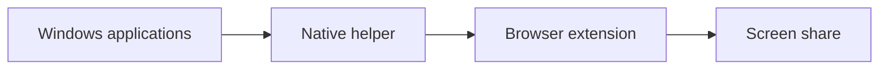

<p align="center">
  <a href="./README.md">English</a> · <a href="./README.pt-BR.md">Português (Brasil)</a>
</p>

<p align="center">
  
</p>

<h1 align="center">ShareGuard</h1>

<p align="center">
  Share your screen. Keep private apps private.
</p>

<p align="center">
  Filter application audio from browser screen sharing without muting what you hear locally.
</p>

<p align="center">
  <a href="https://github.com/UnkoynX777/shareguard/releases/latest"></a>
  <a href="https://github.com/UnkoynX777/shareguard/actions/workflows/ci.yml"></a>
  <a href="./LICENSE"></a>
  
  
</p>

<p align="center">
  <a href="https://github.com/UnkoynX777/shareguard/releases/latest"><strong>Download for Windows</strong></a>
  ·
  <a href="./docs/INSTALLATION.md">Installation</a>
  ·
  <a href="https://github.com/UnkoynX777/shareguard/releases">All releases</a>
</p>

ShareGuard lets you choose which Windows applications can be heard in a browser screen share. A blocked application stays audible to you. It is removed from the audio sent to the site. The video is left as it is.

Free and open source. Processing stays on your computer. There is no account and no audio upload.

## Download

[Download ShareGuard for Windows](https://github.com/UnkoynX777/shareguard/releases/latest)

The file to run is `ShareGuard-Setup-vX.Y.Z-x64.exe`. It installs the native helper for the current Windows user. It does not install the browser extension, and the extension is not in a browser store yet. The same release includes `shareguard-chromium-vX.Y.Z.zip` and `shareguard-firefox-vX.Y.Z.zip`. Check `SHA256SUMS.txt` before you run the installer. The installer is not code-signed.

Windows 10 or 11, 64-bit. Chrome 116+, current Chromium Edge, or Firefox 128+. See [Installation](./docs/INSTALLATION.md).

## What you hear and what viewers hear

| Application | You hear | Viewers hear |
| --- | --- | --- |
| Discord | Yes | No, if you set it to Blocked |
| Spotify | Yes | No, if you set it to Blocked |
| Game | Yes | Yes, while it stays Allowed |
| Browser | Yes | Yes, while it stays Allowed |

Those names are examples. ShareGuard does not treat any executable specially. It lists what is running.

## Features

- Block or allow each application by executable name
- Local playback stays unchanged
- The process list updates while a share is active
- Rules remain when the application restarts with a new process ID
- One helper for Chrome, Edge, and Firefox
- WASAPI process loopback, not a virtual audio cable
- No cloud processing

## Quick start

1. Download the installer from the [latest release](https://github.com/UnkoynX777/shareguard/releases/latest) and run it.
2. Quit Chrome, Edge, and Firefox completely, then open the browser you use.
3. Load the extension package from that same release. Chrome and Edge use the Chromium zip. Firefox uses the Firefox zip as a temporary add-on. Steps are in [Installation](./docs/INSTALLATION.md).
4. Open the ShareGuard popup. Native should read Connected.
5. Turn on ShareGuard Protection and set unwanted applications to Blocked.
6. Start a screen share that includes audio.

## Browser support

| Browser | Package | Notes |
| --- | --- | --- |
| Google Chrome 116+ | `shareguard-chromium` | Load unpacked. Extension ID `bdkcdhphggeglifemnakdlcfbhcoempk` |
| Microsoft Edge | `shareguard-chromium` | Same package as Chrome |
| Firefox 128+ | `shareguard-firefox` | Temporary add-on until it is signed by Mozilla. Firefox ESR 115 is not supported |

Chrome Web Store, Edge Add-ons, and Firefox Add-ons listings do not exist yet.

## How to use

The popup has a protection switch, a search box, and Allow or Blocked on each row. Playing audio is listed first. A blocked executable that is closed stays under Blocked apps. Show all processes reveals entries that are otherwise hidden because they have no window and no audio.

A new application is Allowed until its executable is blocked. Changing the list during a share updates the capture. Closing the popup does not stop the share.

If protection cannot be enforced, ShareGuard removes the shared audio and keeps the video. If the share has no audio track, it does not add one. Cancelling the screen picker still returns the browser's original error to the site.

## How it works

Browser extensions cannot capture per-process Windows audio. ShareGuard uses a small open-source helper, `shareguard-native.exe`, to talk to Windows Core Audio. The browser starts that helper through Native Messaging. The extension replaces the audio track of `getDisplayMedia` with a track built in the page. Your speakers and the Windows volume mixer are not changed.



More detail is in [Architecture](./docs/ARCHITECTURE.md).

## Privacy

ShareGuard processes application names and audio routing on your computer. There is no ShareGuard account, analytics, or telemetry. Shared audio is sent to the website you are sharing with, as it would be without ShareGuard, after the filter is applied. It is not uploaded to a ShareGuard server.

The helper log, when debug is enabled, does not contain audio samples.

## Building

Users do not need this section. Developers:

```powershell
powershell -ExecutionPolicy Bypass -File .\scripts\build-native.ps1
cd extension
npm ci
npm run build
```

[Building](./docs/BUILDING.md) · [Development](./docs/DEVELOPMENT.md) · [Contributing](./CONTRIBUTING.md)

## Troubleshooting

[Native helper unavailable](./docs/TROUBLESHOOTING.md), a missing application, Firefox closing the add-on, and the Windows version message are covered in [Troubleshooting](./docs/TROUBLESHOOTING.md). Security reports go to [SECURITY.md](./SECURITY.md), not to a public issue.

## Roadmap

Available now: Chrome, Edge, and Firefox packages, per-application filtering, and a per-user native installer.

Not available yet: Chrome Web Store, Edge Add-ons, and Firefox Add-ons listings. Code signing of the installer. A Firefox install that survives a browser restart without Mozilla signing.

## License

[MIT](./LICENSE). Created and maintained by [UnkoynX777](https://github.com/UnkoynX777).
