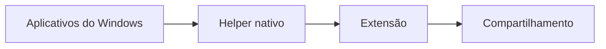

<p align="center">
  <a href="./README.md">English</a> · <a href="./README.pt-BR.md">Português (Brasil)</a>
</p>

<p align="center">
  
</p>

<h1 align="center">ShareGuard</h1>

<p align="center">
  Compartilhe a tela. Deixe os aplicativos privados fora do áudio.
</p>

<p align="center">
  Filtre o áudio dos aplicativos no compartilhamento do navegador sem silenciar o que você ouve no computador.
</p>

<p align="center">
  <a href="https://github.com/UnkoynX777/shareguard/releases/latest"></a>
  <a href="https://github.com/UnkoynX777/shareguard/actions/workflows/ci.yml"></a>
  <a href="./LICENSE"></a>
  
  
</p>

<p align="center">
  <a href="https://github.com/UnkoynX777/shareguard/releases/latest"><strong>Baixar para Windows</strong></a>
  ·
  <a href="./docs/INSTALLATION.md">Instalação</a>
  ·
  <a href="https://github.com/UnkoynX777/shareguard/releases">Todas as releases</a>
</p>

O ShareGuard escolhe quais aplicativos do Windows entram no áudio de um compartilhamento de tela no navegador. O que você bloqueia continua tocando para você e sai do áudio enviado ao site. O vídeo permanece.

É gratuito e open source. O processamento fica no seu computador. Não há conta nem envio de áudio para um servidor do ShareGuard.

## Download

[Baixar o ShareGuard para Windows](https://github.com/UnkoynX777/shareguard/releases/latest)

O arquivo para executar é `ShareGuard-Setup-vX.Y.Z-x64.exe`. Ele instala o helper nativo para o usuário atual do Windows. Ele não instala a extensão, e a extensão ainda não está na loja de nenhum navegador. A mesma release inclui `shareguard-chromium-vX.Y.Z.zip` e `shareguard-firefox-vX.Y.Z.zip`. Confira `SHA256SUMS.txt` antes de executar o instalador. O instalador não tem assinatura de código.

Windows 10 ou 11, 64 bits. Chrome 116 ou mais recente, Edge atual baseado em Chromium, ou Firefox 128 ou mais recente. O passo a passo está em [Instalação](./docs/INSTALLATION.md).

## O que você ouve e o que os outros ouvem

| Aplicativo | Você ouve | Quem assiste ouve |
| --- | --- | --- |
| Discord | Sim | Não, se estiver Blocked |
| Spotify | Sim | Não, se estiver Blocked |
| Jogo | Sim | Sim, enquanto estiver Allowed |
| Navegador | Sim | Sim, enquanto estiver Allowed |

Esses nomes são exemplos. O ShareGuard não trata nenhum executável de forma especial. A lista é o que está em execução.

## Recursos

- Bloquear ou permitir cada aplicativo pelo nome do executável
- O áudio local não muda
- A lista de processos acompanha o compartilhamento
- A regra continua valendo se o programa abrir de novo com outro PID
- Um único helper para Chrome, Edge e Firefox
- Loopback de processo via WASAPI, sem cabo de áudio virtual
- Sem processamento na nuvem

## Começar

1. Baixe o instalador na [última release](https://github.com/UnkoynX777/shareguard/releases/latest) e execute.
2. Feche Chrome, Edge e Firefox por completo e abra de novo o navegador que você usa.
3. Carregue o pacote da extensão dessa mesma release. Chrome e Edge usam o zip Chromium. O Firefox usa o zip Firefox como complemento temporário. Os passos estão em [Instalação](./docs/INSTALLATION.md).
4. Abra o popup do ShareGuard. Native deve mostrar Connected.
5. Ligue ShareGuard Protection e marque como Blocked o que os outros não devem ouvir.
6. Inicie um compartilhamento que inclua áudio.

## Navegadores

| Navegador | Pacote | Observação |
| --- | --- | --- |
| Google Chrome 116+ | `shareguard-chromium` | Carregar sem compactar. ID `bdkcdhphggeglifemnakdlcfbhcoempk` |
| Microsoft Edge | `shareguard-chromium` | O mesmo pacote do Chrome |
| Firefox 128+ | `shareguard-firefox` | Complemento temporário até a assinatura da Mozilla. O Firefox ESR 115 não serve |

Ainda não há página na Chrome Web Store, na Edge Add-ons nem em addons.mozilla.org.

## Uso

O popup tem o interruptor de proteção, uma busca e Allow ou Blocked em cada linha. Quem está tocando aparece primeiro. Um executável bloqueado que está fechado fica em Blocked apps. Show all processes mostra o que fica oculto por não ter janela nem áudio.

Um aplicativo novo entra como Allowed até o executável ser bloqueado. Mudar a lista durante o compartilhamento reconfigura a captura. Fechar o popup não encerra o compartilhamento.

Se a proteção não puder ser garantida, o ShareGuard tira o áudio compartilhado e mantém o vídeo. Se o compartilhamento não tiver faixa de áudio, ele não inventa uma. Cancelar o seletor de tela devolve ao site o erro original do navegador.

## Como funciona

Uma extensão não captura o áudio de cada processo do Windows. O ShareGuard usa um helper pequeno e open source, `shareguard-native.exe`, para falar com o Windows Core Audio. O navegador inicia esse helper por Native Messaging. A extensão troca a faixa de áudio de `getDisplayMedia` por uma faixa criada na própria página. Os alto-falantes e o mixer do Windows não são alterados.



O detalhe está em [Arquitetura](./docs/ARCHITECTURE.md).

## Privacidade

O ShareGuard trata nomes de aplicativos e o roteamento do áudio no seu computador. Não há conta, analytics nem telemetria. O áudio compartilhado segue para o site em que você está compartilhando, como aconteceria sem o ShareGuard, depois do filtro. Ele não é enviado a um servidor do ShareGuard.

O log do helper, quando o debug está ligado, não contém amostras de áudio.

## Compilar

Quem só vai usar o programa pode pular esta parte.

```powershell
powershell -ExecutionPolicy Bypass -File .\scripts\build-native.ps1
cd extension
npm ci
npm run build
```

[Compilação](./docs/BUILDING.md) · [Desenvolvimento](./docs/DEVELOPMENT.md) · [Como contribuir](./CONTRIBUTING.md)

## Problemas

[Helper nativo indisponível](./docs/TROUBLESHOOTING.md), aplicativo ausente, Firefox que descarta o complemento e a mensagem de versão do Windows estão em [Solução de problemas](./docs/TROUBLESHOOTING.md). Vulnerabilidades vão para [SECURITY.md](./SECURITY.md), não para uma issue pública.

## Roteiro

Já existe: pacotes para Chrome, Edge e Firefox, filtro por aplicativo e instalador do helper por usuário.

Ainda não existe: publicação na Chrome Web Store, Edge Add-ons e Firefox Add-ons. Assinatura de código do instalador. Instalação do Firefox que sobreviva ao fechar o navegador sem a assinatura da Mozilla.

## Licença

[MIT](./LICENSE). Criado e mantido por [UnkoynX777](https://github.com/UnkoynX777).
