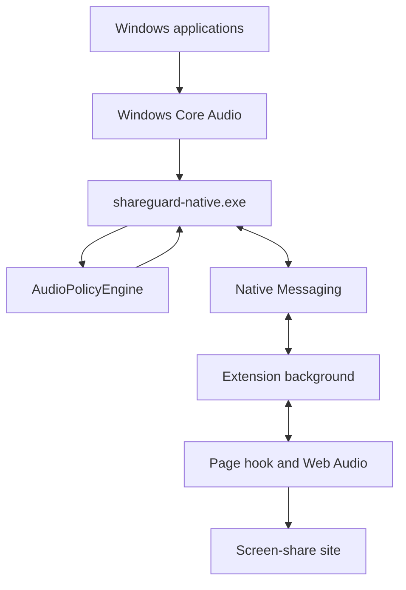

# Architecture

ShareGuard filters the audio of a browser screen share. It does not change what you hear on the computer. No application name is special-cased. Discord, Spotify, or any other executable appears because it is running.

The page creates the protected audio track. A `MediaStreamTrack` created in the Chromium service worker, the Firefox background page, or an offscreen document cannot be added to the `MediaStream` returned by `getDisplayMedia`. PCM is the transport. The background only forwards frames.

## Native helper

`main.cpp` constructs `Application` and calls `run()`. `Application` connects the modules. It does not capture audio or enumerate processes itself.

| Module | Role |
| --- | --- |
| `ProcessCatalog` | Builds the process snapshot |
| `ProcessTree` | Groups a tree that shares one executable into one application |
| `ProcessIdentity` | Persistent key: lowercase executable name. The display name comes from the file version and is cached |
| `AudioSessionCatalog` | Process IDs with an active session on the default output device |
| `ProcessMonitor` | Scans about once a second and emits a diff when something changed |
| `AudioPolicy` | Protection on or off, and blocked identities |
| `AudioPolicyEngine` | The only place that chooses a capture strategy |
| `AudioEngine` | Runs capture and emits 20 ms frames |
| `ProcessCapturePool` | Opens and closes `INCLUDE` captures per tree, without capturing a child of a tree that is already included |
| `AudioMixer` | Sums float samples and clamps them to -1..1 |
| `NativeMessagingHost` | stdin/stdout transport, one connection |
| `MessageDispatcher` | Routes protocol messages |

Strategies:

- `SystemLoopback` when protection is off, or no blocked application is running.
- `SingleProcessExclusion` when exactly one blocked identity is running and it has one root. The call uses `PROCESS_LOOPBACK_MODE_EXCLUDE_TARGET_PROCESS_TREE` with one `TargetProcessId`.
- `AllowedProcessMix` otherwise. Several exclusions are not mixed, because each exclusion still contains the allowed audio and summing them would duplicate it. The pool opens `PROCESS_LOOPBACK_MODE_INCLUDE_TARGET_PROCESS_TREE` only for allowed roots that are producing audio and are not descendants of another included root. A root that contains a blocked process is left out, so the blocked audio does not leak.

The internal format is 48 kHz, stereo, float. Conversion to `s16le` happens when the `AudioFrame` is built. The rings hold about 250 ms and drop the oldest audio.

If a capture that should enforce a block fails, the helper does not fall back to the full system mix. The extension removes the shared audio track and leaves the video.

The helper does not branch on Chrome, Edge, or Firefox. The browser only changes which Native Messaging manifest and registry key are allowed to launch it.

## Extension

Chrome and Edge load the same bundle as a Manifest V3 service worker. Firefox 128 or newer loads that bundle as a background script. Browser API access stays in `extension/src/platform/browser`. Feature checks live in `detectCapabilities.ts`. Audio decisions do not branch on the browser name.

Rules are stored in `storage.local` under `shareguardRules`: `protectionEnabled`, `blockedApplications`, and `showAllProcesses`. The key is the executable identity, not the PID.

The popup watches that state. Closing the popup does not end an active share. With no share and no popup, the native connection can drop so the helper is idle.

`page/display-media-hook.ts` wraps `getDisplayMedia` in the page MAIN world. The content script is only a bridge. The page cannot send arbitrary commands to the native helper. Accepted page messages are `get-enabled`, `begin-share`, `end-share`, and `protect-failed`.

Content scripts match `http://*/*` and `https://*/*` so the hook exists on ordinary websites. The manifests do not request `<all_urls>`.

When protection is off, or the stream has no audio track, the original stream is returned. ShareGuard does not invent an audio track. If the user cancels the picker, the original `getDisplayMedia` error, including `NotAllowedError`, is returned to the site. If protection is on and the helper fails, the original audio tracks are removed and the video stays.

## Protocol

Version 2. The handshake is `HELLO` / `HELLO_ACK` with `protocolVersion`. `HELLO` may include `client.browser` and `client.extensionVersion` for diagnostics. The helper does not change the capture because of that field. A different version returns `PROTOCOL_VERSION_MISMATCH`.

Messages: `GET_PROCESS_SNAPSHOT`, `PROCESS_SNAPSHOT`, `PROCESS_DIFF`, `SET_AUDIO_POLICY`, `AUDIO_POLICY_APPLIED`, `START_CAPTURE`, `CAPTURE_STARTED`, `STOP_CAPTURE`, `CAPTURE_STOPPED`, `AUDIO_FRAME`, `GET_STATUS`, `STATUS`, `ERROR`, `PING`, `PONG`.

A snapshot lists grouped applications: `id`, `rootPid`, `name`, `executable`, `audioActive`, `processCount`. `id` is the lowercase executable. PIDs are not saved as rules.

Helper error codes: `UNSUPPORTED_WINDOWS`, `AUDIO_INITIALIZATION_FAILED`, `PROCESS_CAPTURE_FAILED`, `PROTOCOL_VERSION_MISMATCH`, `CAPTURE_STOPPED_UNEXPECTEDLY`. If the host is not registered, the popup shows `Native helper unavailable`. The helper process is not running, so it cannot send that string itself.

`UNSUPPORTED_WINDOWS` is used when process-loopback activation fails and the Windows build is below 20348. The message is `ShareGuard requires a newer version of Windows.` The helper still attempts activation from build 19041 upward. Microsoft documents the API from build 20348.
