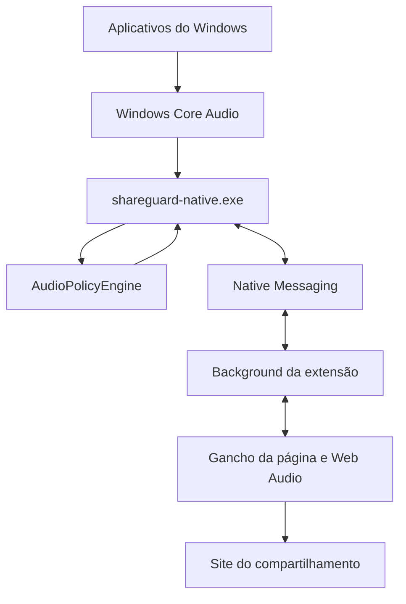

[English](./ARCHITECTURE.md) | Português (Brasil)

# Arquitetura

O ShareGuard filtra o áudio de um compartilhamento de tela no navegador. Ele não muda o que você ouve no computador. Nenhum nome de aplicativo é tratado como caso especial. Discord, Spotify ou qualquer outro executável aparece porque está em execução.

A página cria a faixa de áudio protegida. Um `MediaStreamTrack` criado no service worker do Chromium, na página de background do Firefox ou num offscreen document não pode ser colocado no `MediaStream` devolvido por `getDisplayMedia`. PCM é o transporte. O background só encaminha os frames.

## Helper nativo

`main.cpp` constrói `Application` e chama `run()`. `Application` liga os módulos. Ele não captura áudio nem enumera processos sozinho.

| Módulo | Papel |
| --- | --- |
| `ProcessCatalog` | Monta o snapshot de processos |
| `ProcessTree` | Agrupa uma árvore que compartilha um executável num único aplicativo |
| `ProcessIdentity` | Chave persistente: nome do executável em minúsculas. O nome de exibição vem da versão do arquivo e fica em cache |
| `AudioSessionCatalog` | IDs de processo com sessão ativa no dispositivo de saída padrão |
| `ProcessMonitor` | Varre cerca de uma vez por segundo e emite um diff quando algo mudou |
| `AudioPolicy` | Proteção ligada ou desligada, e identidades bloqueadas |
| `AudioPolicyEngine` | O único lugar que escolhe a estratégia de captura |
| `AudioEngine` | Empacota o áudio capturado em frames de 20 ms só quando um bloco inteiro está disponível; um writer separado envia esses frames |
| `ProcessCapturePool` | Abre e fecha capturas `INCLUDE` por árvore, sem capturar um filho de uma árvore que já está incluída |
| `AudioMixer` | Soma amostras float e limita a -1..1 |
| `NativeMessagingHost` | Transporte stdin/stdout, uma conexão |
| `MessageDispatcher` | Encaminha as mensagens do protocolo |

Estratégias:

- `SystemLoopback` quando a proteção está desligada, ou nenhum aplicativo bloqueado está em execução.
- `SingleProcessExclusion` quando exatamente uma identidade bloqueada está em execução e ela tem uma raiz. A chamada usa `PROCESS_LOOPBACK_MODE_EXCLUDE_TARGET_PROCESS_TREE` com um `TargetProcessId`.
- `AllowedProcessMix` nos outros casos. Várias exclusões não são misturadas, porque cada exclusão ainda contém o áudio permitido e somá-las duplicaria esse áudio. O pool abre `PROCESS_LOOPBACK_MODE_INCLUDE_TARGET_PROCESS_TREE` só para raízes permitidas que estão produzindo áudio e não são descendentes de outra raiz incluída. Uma raiz que contém um processo bloqueado fica de fora, para o áudio bloqueado não vazar.

O formato interno é 48 kHz, estéreo, float. O WASAPI pode entregar outro formato de mix; a conversão para esse formato canônico acontece uma vez, e o resampler guarda o resto entre pacotes. A conversão para `s16le` acontece quando o `AudioFrame` é montado.

O thread de captura só copia amostras para um ring. Ele não codifica nem escreve em stdout. O thread de mix emite um pacote quando há pelo menos 960 frames na fila. Ele não completa uma leitura curta com silêncio. Um thread writer faz Base64 e Native Messaging. A página reproduz a partir de um ring do AudioWorklet com cerca de 160 ms de prebuffer, então o jitter do transporte não é o clock de reprodução. `SHAREGUARD_DEBUG=1` registra uma linha de áudio nativo a cada dois segundos. A página escreve a linha correspondente com `console.debug` durante um compartilhamento.

Se uma captura que deveria aplicar um bloqueio falhar, o helper não volta para o mix completo do sistema. A extensão remove a faixa de áudio compartilhada e deixa o vídeo.

O helper não ramifica em Chrome, Edge ou Firefox. O navegador só muda qual manifesto de Native Messaging e qual chave de registro podem iniciá-lo.

## Extensão

Chrome e Edge carregam o mesmo bundle como service worker do Manifest V3. O Firefox 128 ou mais recente carrega esse bundle como script de background. O acesso à API do navegador fica em `extension/src/platform/browser`. As checagens de recurso ficam em `detectCapabilities.ts`. Decisões de áudio não ramificam pelo nome do navegador.

As regras ficam em `storage.local`, na chave `shareguardRules`: `protectionEnabled`, `blockedApplications` e `showAllProcesses`. A chave é a identidade do executável, não o PID.

O popup observa esse estado. Fechar o popup não encerra um compartilhamento ativo. Sem compartilhamento e sem popup, a conexão nativa pode cair para o helper ficar ocioso.

`page/display-media-hook.ts` envolve `getDisplayMedia` no mundo MAIN da página. O content script é só uma ponte. A página não pode enviar comandos arbitrários ao helper nativo. As mensagens aceitas da página são `get-enabled`, `begin-share`, `end-share` e `protect-failed`.

Os content scripts combinam com `http://*/*` e `https://*/*` para o gancho existir em sites comuns. Os manifestos não pedem `<all_urls>`.

Com a proteção desligada, ou quando o stream não tem faixa de áudio, o stream original é devolvido. O ShareGuard não inventa uma faixa de áudio. Se a pessoa cancelar o seletor, o erro original de `getDisplayMedia`, inclusive `NotAllowedError`, volta para o site. Se a proteção estiver ligada e o helper falhar, as faixas de áudio originais são removidas e o vídeo permanece.

## Protocolo

Versão 2. O handshake é `HELLO` / `HELLO_ACK` com `protocolVersion`. `HELLO` pode incluir `client.browser` e `client.extensionVersion` para diagnóstico. O helper não muda a captura por causa desse campo. Uma versão diferente devolve `PROTOCOL_VERSION_MISMATCH`.

Mensagens: `GET_PROCESS_SNAPSHOT`, `PROCESS_SNAPSHOT`, `PROCESS_DIFF`, `SET_AUDIO_POLICY`, `AUDIO_POLICY_APPLIED`, `START_CAPTURE`, `CAPTURE_STARTED`, `STOP_CAPTURE`, `CAPTURE_STOPPED`, `AUDIO_FRAME`, `GET_STATUS`, `STATUS`, `ERROR`, `PING`, `PONG`.

Um snapshot lista aplicativos agrupados: `id`, `rootPid`, `name`, `executable`, `audioActive`, `processCount`. `id` é o executável em minúsculas. PIDs não são gravados como regras.

Códigos de erro do helper: `UNSUPPORTED_WINDOWS`, `AUDIO_INITIALIZATION_FAILED`, `PROCESS_CAPTURE_FAILED`, `PROTOCOL_VERSION_MISMATCH`, `CAPTURE_STOPPED_UNEXPECTEDLY`. Se o host não estiver registrado, o popup mostra `Native helper unavailable`. O processo do helper não está em execução, então ele não pode enviar essa frase.

`UNSUPPORTED_WINDOWS` é usado quando a ativação do process loopback falha e a build do Windows é inferior a 20348. A mensagem é `ShareGuard requires a newer version of Windows.` O helper ainda tenta a ativação a partir da build 19041. A Microsoft documenta a API a partir da build 20348.
